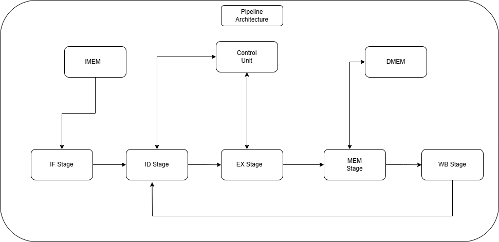

# riscv32-pipelined-cpu

## RV32I 5-Stage Pipelined Processor

A 32-bit RISC-V processor implementing a subset of the **RV32I base instruction set** using a classic **5-stage pipeline** and **Harvard memory architecture**.
The design focuses on a clean modular microarchitecture with hazard handling and a structured SystemVerilog RTL implementation suitable for simulation and architectural study.

---

## Features

* RV32I instruction subset implementation
* Classic **5-stage pipeline architecture**
* **Hazard detection and data forwarding**
* Modular **SystemVerilog RTL design**
* Structured **simulation environment**
* Architecture documentation and pipeline design breakdown

---

## Pipeline Architecture

The processor follows the classic RISC pipeline structure.

| Stage | Description                          |
| ----- | ------------------------------------ |
| IF    | Instruction Fetch                    |
| ID    | Instruction Decode and Register Read |
| EX    | Execute / ALU Operations             |
| MEM   | Data Memory Access                   |
| WB    | Write Back to Register File          |

Pipeline registers isolate each stage:

```
IF/ID → ID/EX → EX/MEM → MEM/WB
```

The pipeline includes hazard management through forwarding logic and stall mechanisms.

---

## Supported Instruction Set

### R-Type (Register–Register ALU)

```
ADD  SUB  AND  OR
SLT
```

### I-Type (Immediate / Load)

```
ADDI  ANDI  ORI 
LW
```

### S-Type (Store)

```
SW
```

### B-Type (Branch)

```
BEQ  BNE
```

### U-Type

```
LUI
```

### J-Type

```
JAL
```

---

## Project Structure

```
riscv32-pipelined-cpu/
│
├── docs/        # Architecture diagrams and design specifications
│
├── rtl/         # SystemVerilog RTL modules
│
├── sim/         # Simulation configuration and scripts
│
├── tb/          # Verification testbench environment
│
└── scripts/     # Utility and automation scripts
```

---

## Design Goals

* Develop a **clean and modular pipelined CPU microarchitecture**
* Implement **hazard detection and forwarding mechanisms**
* Maintain a **clear separation between datapath and control logic**
* Provide a well-documented design suitable for **learning and architectural experimentation**

---

## Simulation

The processor is designed to be simulated using common RTL simulation tools.
Waveforms can be analyzed using waveform viewers such as **GTKWave**.

Simulation scripts and configurations are located in the `sim/` directory.

### Running Tests

Run the program testbench:
```bash
verilator --cc --exe --build --timing --main -Wno-fatal --trace --top-module program_tb \
    rtl/pkg/cpu_params.sv rtl/pkg/riscv_pkg.sv rtl/pkg/pipeline_pkg.sv \
    tb/block_tests/cpu/program_tb.sv rtl/cpu_top.sv rtl/utils/*.sv \
    rtl/fetch/*.sv rtl/decode/*.sv rtl/execute/*.sv rtl/control/*.sv \
    rtl/memory/*.sv rtl/pipeline/*.sv
./obj_dir/Vprogram_tb
```

### Performance Comparison

| Metric | Our CPU (Measured) | Spike (Ideal) | Notes |
|--------|-------------------|--------------|-------|
| CPI | 2.25 | 1.0 | 5-stage pipeline overhead |
| Cycles (4 instr) | 9 | 4 | Pipeline fill + flush |
| IPC | 0.44 | 1.0 | Baseline implementation |
| Pipeline Depth | 5 | 1- pipeline | Spike is in-order |

**Test Program:**
```assembly
addi x1, x0, 5    # x1 = 5
addi x2, x0, 3    # x2 = 3
add  x3, x1, x2    # x3 = 8
nop                 # end
```

**Expected Results:**
- x1 = 5
- x2 = 3
- x3 = 8

---

## License

This project is open-source and intended for **educational and research purposes**.



